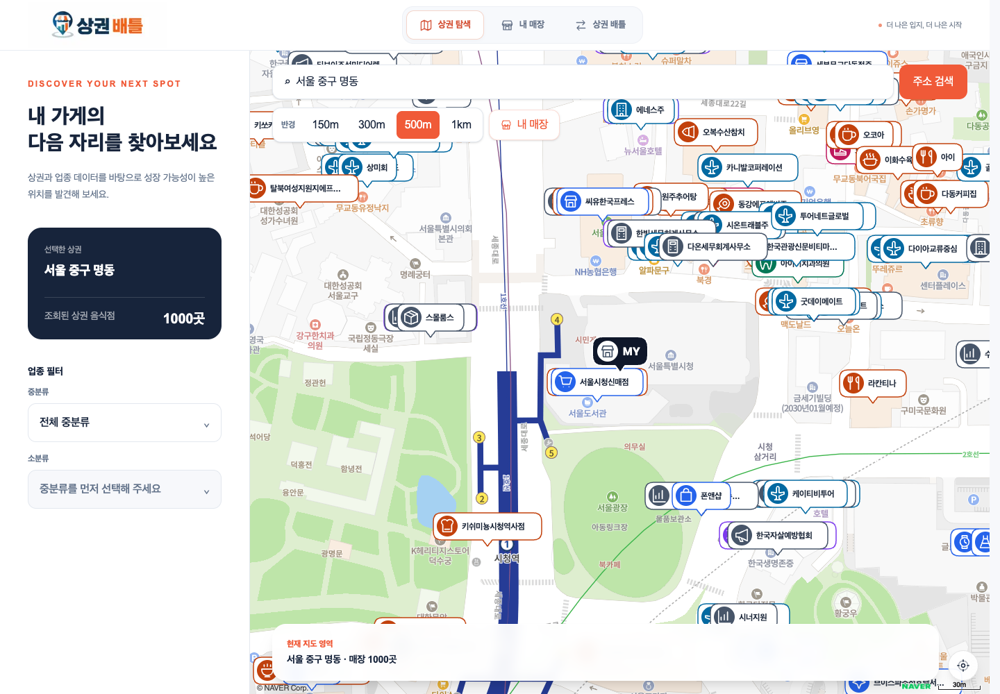
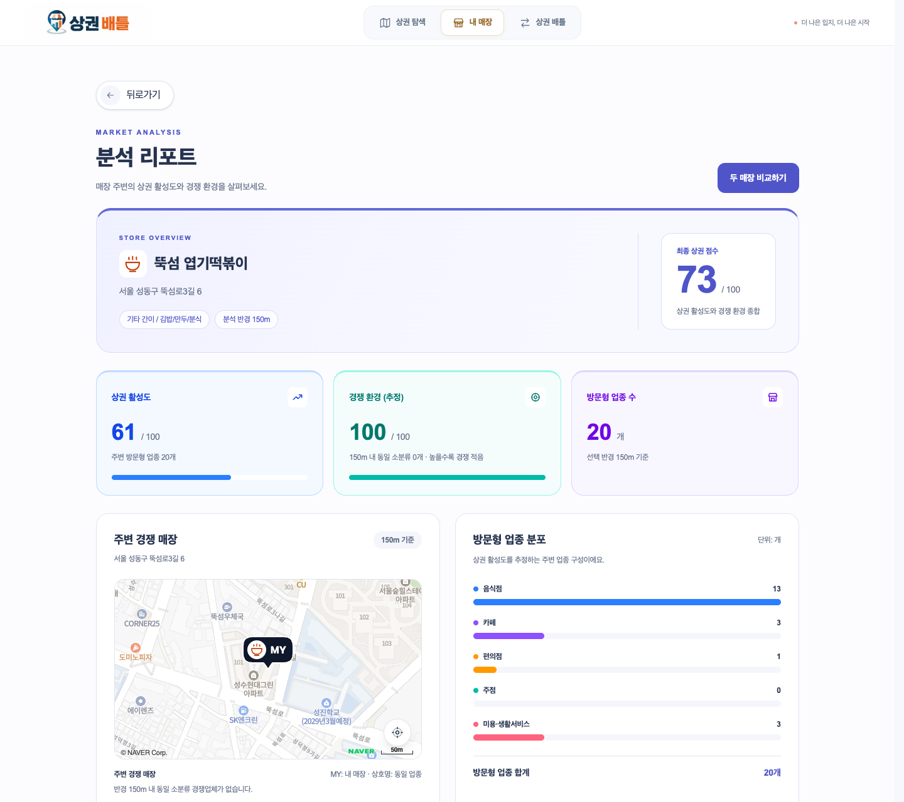
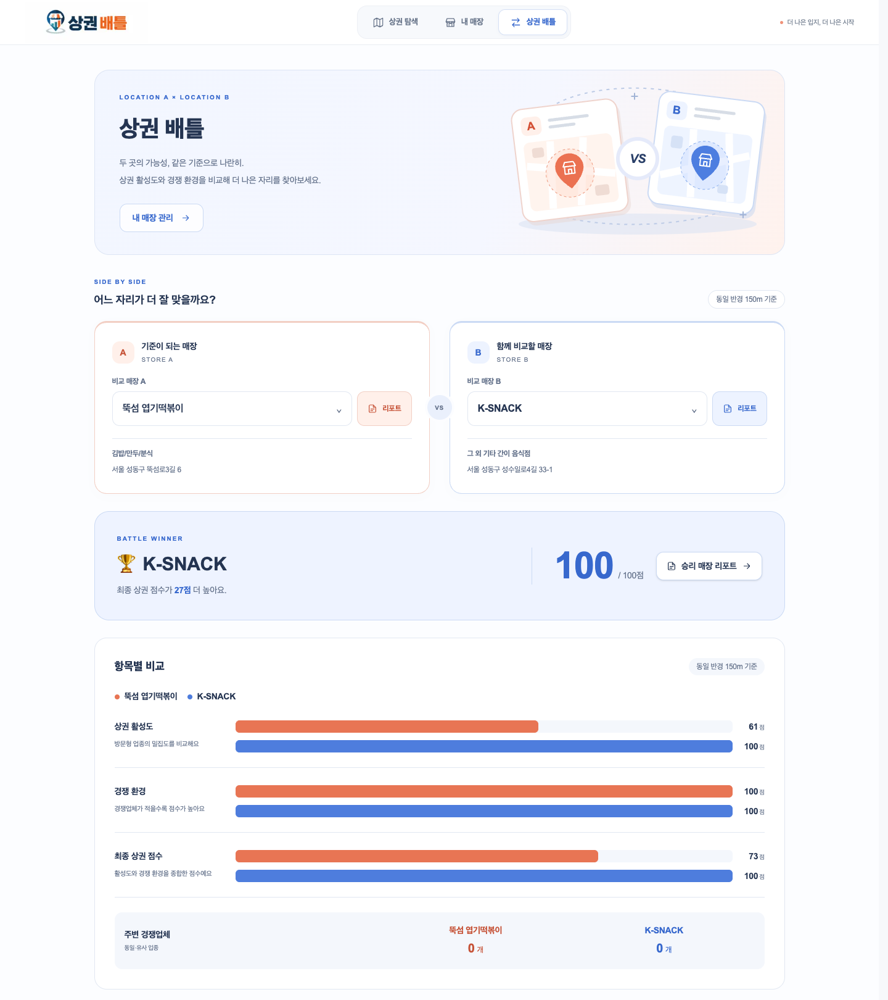

# Commercial Battle · 상권 배틀

## 서비스 개요

지도에서 주변 상권을 탐색하고, 등록한 매장의 입지를 분석하거나 두 매장의 상권 점수를 비교하는 웹 서비스입니다. 소상공인시장진흥공단의 상가업소 데이터를 바탕으로 **상권 활성도와 동일 업종 경쟁 환경**을 계산합니다.

배포 서비스: [https://commercial-battle.vercel.app/](https://commercial-battle.vercel.app/)

배포 환경에서는 JSON Server 없이 브라우저의 `localStorage`를 사용해 매장 데이터를 저장합니다. 따라서 등록·수정·삭제한 매장 정보는 현재 브라우저와 도메인에만 유지되며, 다른 기기나 브라우저와 공유되지 않습니다.

## 핵심 화면

**상권 탐색 → 분석 리포트 → 상권 배틀** 순서로 입지를 살펴보고 비교할 수 있습니다.

### 01. 상권 탐색

주소와 업종, 탐색 반경을 선택해 주변 매장의 분포를 지도에서 확인합니다.

[](docs/screenshots/explore.png)

### 02. 분석 리포트

등록한 매장의 **종합 점수·상권 활성도·경쟁 환경**과 주변 경쟁 매장, 방문형 업종 분포를 한눈에 확인합니다.

[](docs/screenshots/report.png)

### 03. 상권 배틀

두 매장을 선택하면 같은 반경을 기준으로 **최종 점수와 항목별 차이**를 비교합니다. 코랄색 A와 블루색 B로 각 매장을 구분합니다.

[](docs/screenshots/battle.png)

> 화면은 로컬 실행 환경의 예시입니다. 조회 시점과 선택한 위치·업종에 따라 결과가 달라집니다. 이미지를 클릭하면 원본 크기로 볼 수 있습니다.

## 주요 페이지

| 화면        | 경로           | 기능                                                                     |
| ----------- | -------------- | ------------------------------------------------------------------------ |
| 상권 탐색   | `/explore`     | 주소·내 매장 기준 위치 선택, 업종 필터, 반경별 점포 조회, 지도 마커 표시 |
| 내 매장     | `/stores`      | 매장 등록·조회·수정·삭제                                                 |
| 분석 리포트 | `/stores/[id]` | 상권 활성도, 경쟁 환경, 최종 점수, 경쟁 매장 지도와 업종 분포            |
| 상권 배틀   | `/battle`      | 두 매장의 점수와 주변 경쟁업체 수 비교                                   |

`/`는 `/explore`로 이동하며, `/shop`은 내 매장 화면을 재사용합니다.

## 기술 스택

- **Next.js 16.3.5 / React 19.2.8 / TypeScript**: App Router 기반 화면과 주소 검색 API 구현
- **Tailwind CSS 4**: 화면 스타일링
- **TanStack Query 5**: API 조회, 캐시, 매장 변경 요청 관리
- **Zustand 5**: 탐색 위치·반경·업종 필터와 대결 대상 매장 상태 공유
- **Naver Maps JavaScript API**: 지도와 매장 마커 표시
- **JSON Server**: 로컬 매장 CRUD API와 파일 기반 데이터 저장
- **pnpm 12.5.1**: 패키지 관리

## 실행 방법

```bash
pnpm install
```

프로젝트 루트에 `.env.local`을 만들고 아래 환경변수를 설정합니다. 이후 두 터미널에서 각각 실행합니다.

```bash
# 터미널 1: 매장 데이터 API (http://localhost:4000)
pnpm dev:server
```

```bash
# 터미널 2: 프런트엔드 (http://localhost:3000)
pnpm dev
```

매장 데이터는 `server/db.json`에 저장되며, 등록·수정·삭제 결과도 이 파일에 반영됩니다.

### JSON Server 없이 실행·배포하기

`NEXT_PUBLIC_JSON_SERVER_URL`을 설정하지 않으면 매장 조회·등록·수정·삭제에 브라우저의 **localStorage**를 사용합니다. 주소가 설정되어 있어도 연결 실패, 3초 타임아웃 또는 서버의 5xx 응답 시 자동으로 로컬 모드로 전환합니다. 지도·주소 검색·상권 분석용 API 키는 계속 필요합니다.

- 처음에는 빈 매장 목록으로 시작하며, 등록한 데이터는 같은 브라우저·사이트에서 새로고침 후에도 유지됩니다.
- 서버에서 정상 조회한 매장 데이터도 로컬에 보관해 연결 중단 시 활용합니다.
- 로컬 모드는 새로고침 후에도 유지하며, 서버 복구 시 자동 동기화하지 않습니다. 서버 모드로 돌아가려면 개발자 도구에서 `commercial-battle:stores:local-mode` 키를 삭제하고 새로고침합니다. 로컬 변경분은 서버에 전송되지 않습니다.
- 데이터는 `commercial-battle:stores:v1` 키에 저장됩니다. 다른 브라우저·기기와 공유되지 않으며, 사이트 저장소를 삭제하면 사라집니다.

| 명령어            | 설명                               |
| ----------------- | ---------------------------------- |
| `pnpm dev`        | Next.js 개발 서버 실행             |
| `pnpm dev:server` | JSON Server를 4000번 포트에서 실행 |
| `pnpm build`      | 프로덕션 빌드                      |
| `pnpm start`      | 빌드된 Next.js 서버 실행           |
| `pnpm lint`       | ESLint 검사                        |

## 환경변수 예시

```dotenv
# .env.local

# 로컬 매장 API 주소 (끝에 / 없이 입력)
NEXT_PUBLIC_JSON_SERVER_URL=http://localhost:4000

# 소상공인시장진흥공단 상가(상권)정보 API 서비스 키
NEXT_PUBLIC_COMMERCIAL_KEY=your_commercial_service_key

# Naver Maps JavaScript API 키 ID (스크립트의 ncpKeyId로 사용)
NEXT_PUBLIC_NAVER_CLIENT_ID=your_naver_maps_key_id

# Kakao Local API REST API 키 (서버에서 사용)
KAKAO_REST_KEY=your_kakao_rest_api_key
```

`NEXT_PUBLIC_` 변수는 브라우저 코드에서 사용됩니다. Kakao 키는 Next.js Route Handler에서 읽으므로 `KAKAO_REST_KEY`로 설정합니다. 코드에는 `NEXT_PUBLIC_KAKAO_REST_KEY`를 읽는 호환 경로도 있지만, 위 서버 전용 변수만 설정하면 됩니다. 환경변수 변경 후에는 개발 서버를 재시작합니다.

## 폴더 구조

```text
commercial-battle/
├── app/                         # 페이지 라우팅, 레이아웃, 전역 스타일
│   ├── api/address/             # Kakao 주소 검색·역지오코딩 Route Handler
│   ├── explore/                 # 상권 탐색
│   ├── stores/[id]/             # 매장 목록·상세 리포트
│   ├── battle/                  # 매장 비교
│   ├── shop/                    # 내 매장 페이지 재사용
│   └── RootLayoutProvider.tsx   # TanStack Query 공통 Provider
├── src/
│   ├── components/              # 화면별 UI
│   │   ├── explore/
│   │   ├── stores/
│   │   ├── report/
│   │   └── battle/
│   ├── api/                     # 매장 생성·수정·삭제 API 함수
│   ├── hooks/                   # 매장 변경 및 리포트 분석 훅
│   ├── store/                   # Zustand 상태 (explore, stores, battle)
│   ├── constants/               # 업종 분류, 경쟁 기준값, 마커 아이콘 등
│   ├── types/                   # 매장·리포트 등 도메인 타입
│   └── shared/                 # 여러 화면에서 사용하는 공통 코드
│       ├── api/                 # 매장 조회·공공데이터 API 함수
│       ├── components/          # 지도, 마커, 주소 검색 모달, 업종 선택 등
│       ├── hooks/               # 공통 조회 훅, 주소 검색, 디바운스
│       ├── queries/             # 반경 조회의 쿼리 키·캐시 옵션
│       ├── types/               # 공공데이터 응답 타입
│       └── utils/               # fetch 래퍼, 점수 계산, 마커 클러스터링 등
├── server/db.json              # JSON Server 매장 데이터
├── scripts/                    # 공공데이터 업종 분류 동기화 스크립트
├── docs/competition-score.md   # 경쟁 점수 기준과 해석 문서
└── public/                     # 정적 자산
```

### 이 구조를 사용하는 이유

현재 구조는 **역할별 분리 안에서 화면별로 코드를 묶는 방식**입니다.

- **라우팅과 기능 구현 분리**: `app`은 페이지 진입점과 서버 API를 담당하고, 화면 구현은 `src`에 두어 라우팅 코드와 기능 코드를 구분합니다.
- **관련 화면을 쉽게 찾기**: `components`와 `store` 아래를 `explore`, `stores`, `battle` 등으로 나눠 변경할 기능의 위치를 파악하기 쉽게 합니다.
- **화면 간 재사용**: 지도, 주소 검색, 업종 선택, 매장 조회처럼 여러 기능에 필요한 코드는 `shared`에서 함께 사용합니다.
- **UI와 계산 로직 분리**: API 함수는 통신을, 훅은 조회 상태와 데이터 조합을, 유틸은 점수 계산을 담당합니다. 리포트와 배틀이 같은 계산 함수를 사용하므로 점수 기준을 한 곳에서 수정할 수 있습니다.
- **서버 상태와 화면 상태 분리**: API 응답·캐시는 TanStack Query로, 위치·필터·비교 대상 같은 화면 상태는 Zustand로 관리합니다.

## 사용하는 API

| 서비스                              | API                                                       | 사용 목적                                                   |
| ----------------------------------- | --------------------------------------------------------- | ----------------------------------------------------------- |
| 소상공인시장진흥공단 상가(상권)정보 | `storeListInRadius`                                       | 좌표·반경·중분류 또는 소분류 기준 점포 조회, 분석 점수 집계 |
| 소상공인시장진흥공단 상가(상권)정보 | `storeListInUpjong`                                       | 업종별 점포 조회 함수 제공                                  |
| 소상공인시장진흥공단 상가(상권)정보 | `smallUpjongList`                                         | 스크립트에서 업종 분류 상수 생성                            |
| Naver Maps                          | Maps JavaScript API v3                                    | 지도 렌더링, 위치·매장·클러스터 마커 표시                   |
| Kakao Local                         | `search/address.json`, `search/keyword.json`              | 주소 검색 후 결과가 없으면 건물명·장소 키워드 검색          |
| Kakao Local                         | `geo/coord2address.json`                                  | 위도·경도를 주소로 변환                                     |
| JSON Server                         | `GET /stores`, `GET /stores/:id`                          | 등록 매장 목록·상세 조회                                    |
| JSON Server                         | `POST /stores`, `PATCH /stores/:id`, `DELETE /stores/:id` | 매장 등록·수정·삭제                                         |

공공데이터 API의 기본 주소는 `https://apis.data.go.kr/B553077/api/open/sdsc2`입니다. 브라우저에서 공공데이터와 JSON Server에 직접 요청하며, Kakao 요청은 `/api/address/search`와 `/api/address/reverse`를 거칩니다.

## 주요 로직

### 1. 상권 탐색과 데이터 조회

주소 또는 내 매장을 선택하면 탐색 좌표를 갱신하고, 선택한 반경과 업종 코드로 주변 점포를 조회합니다. 탐색 반경은 **150·300·500·1,000m**이며 기본값은 **500m**입니다.

반경 조회는 첫 페이지를 최대 1,000건까지 요청합니다. 지도는 응답의 `items`를 사용하고, 점수 집계는 전체 건수인 `totalCount`를 사용합니다. 따라서 조회 결과가 1,000건을 넘으면 지도에 표시되는 점포 수와 전체 집계 수가 다를 수 있습니다.

공통 쿼리 옵션은 좌표를 소수점 넷째 자리로 반올림해 쿼리 키와 요청에 사용합니다. 반경·좌표·업종이 같은 요청의 캐시를 공유하며, 데이터 유효 시간은 15분, 미사용 캐시 보관 시간은 1시간입니다. 주소 검색은 300ms 디바운스와 이전 요청 취소를 적용합니다.

### 2. 상권 활성도 점수

리포트와 배틀은 모두 **반경 150m**를 사용합니다. `useStoreTrafficQueries`에서 아래 업종을 9개 쿼리로 병렬 조회하고, 각 응답의 `totalCount`를 합산합니다.

| 집계 그룹 | 조회 업종 코드       | 가중치 |
| --------- | -------------------- | ------ |
| 음식점    | 중분류 `I201`~`I205` | 1.0    |
| 카페 그룹 | 중분류 `I212`        | 1.2    |
| 편의점    | 소분류 `G20405`      | 1.5    |
| 주점      | 중분류 `I211`        | 0.8    |
| 미용 그룹 | 중분류 `S207`        | 0.6    |

```text
가중 점포 수 W = 음식점 × 1.0 + 카페 × 1.2 + 편의점 × 1.5
               + 주점 × 0.8 + 미용 × 0.6

면적(km²) = π × (반경(m) / 1000)²
가중 밀도 D = W / 면적
상권 활성도 A = round(min(D / 500, 1)^0.85 × 100)
```

주변 방문형 업종의 가중 밀도가 높을수록 점수가 높아지며 최대 100점입니다. `500`은 코드의 정규화 기준값(`p95Density` 기본값)으로, 현재 코드에서 실제 지역별 95백분위 통계를 산출하지는 않습니다. 가중치와 지수도 서비스 자체 설정값이며, **실제 유동인구를 측정한 점수가 아닙니다.**

구현: [조회 훅](src/hooks/report/useStoreTrafficQueries.ts), [활성도 계산](src/shared/utils/calculateTrafficScore.ts)

### 3. 경쟁 환경 점수

반경 150m 안에서 **같은 소분류 업종**의 경쟁업체 수를 구합니다. API의 `totalCount`에서 본인 매장이 유일하게 확인되는 경우에만 1곳을 제외합니다. 앱의 매장 ID와 공공데이터의 업체 ID는 다르므로, 소분류 코드·상호·주소를 대조합니다.

```text
n = 동일 소분류 경쟁업체 수
b = 해당 소분류의 50점 기준 업체 수
경쟁 환경 C = round(100 × 2^(-n / b))
```

경쟁업체가 0곳이면 100점, `b`곳이면 50점, `2b`곳이면 25점입니다. **점수가 높을수록 근거리 동일 업종 경쟁이 적다는 의미**입니다.

| 기준값 b | 업종 예시                        |
| -------- | -------------------------------- |
| 1        | 생수/음료 소매, 주유소, 종합병원 |
| 2        | 주류 소매, 세탁소                |
| 3        | 편의점, 슈퍼마켓, 치킨, 약국     |
| 4        | 미용실, 백반/한정식, 부동산 중개 |
| 6        | 카페                             |

예를 들어 경쟁업체가 3곳이면 편의점은 50점, 생수/음료 소매는 13점, 카페는 71점입니다. 247개 소분류의 기준값은 업종 특성을 고려해 수동 설정한 초기값이며, 공인 통계나 적정 업체 수를 뜻하지 않습니다.

구현: [경쟁 점수 계산](src/shared/utils/calculateCompetitionScore.ts), [업종별 기준값](src/constants/competition-baselines.ts). 상세 근거와 한계는 [경쟁 점수 문서](docs/competition-score.md)에 정리되어 있습니다.

### 4. 최종 상권 점수와 배틀

```text
A = 상권 활성도 점수
C = 경쟁 환경 점수
최종 점수 = round(A × 0.7 + min(C, A × 2) × 0.3)
```

활성도에 70%, 경쟁 환경에 30%를 반영하되, 경쟁 환경의 반영값을 활성도의 2배로 제한합니다. 주변 방문형 업종이 적은 지역에서 경쟁업체가 없다는 이유만으로 최종 점수가 과도하게 높아지는 것을 줄이기 위한 설계입니다.

- 활성도 0점이면 경쟁 환경과 관계없이 최종 0점입니다.
- 활성도 20점·경쟁 환경 100점이면 최종 26점입니다.
- 활성도 80점·경쟁 환경 100점이면 최종 86점입니다.

리포트와 배틀은 같은 계산 함수를 사용합니다. 배틀은 두 매장의 최종 점수를 비교하며, 점수가 같으면 무승부로 표시합니다.

구현: [최종 점수 계산](src/shared/utils/calculateTotalScore.ts), [배틀 결과](src/components/battle/BattleResult.tsx)

### 5. 점수 해석과 현재 제약

점수는 주변 점포 구성으로 산정한 초기 추정치입니다. 실제 유동인구, 매출, 임대료, 고객 수요, 브랜드 경쟁력, 지역별 집적 효과는 반영하지 않습니다. 배달·온라인·기업 대상 업종처럼 영업권이 넓은 경우에는 150m 밖의 경쟁도 별도로 고려해야 합니다.

본인 매장은 조회된 목록 안에서 상호·주소·소분류가 일치할 때만 제외하므로, 표기 차이나 페이지 제한으로 제외하지 못할 수 있습니다. 활성도 집계에는 본인 매장 제외 로직이 없습니다.

알 수 없는 소분류의 경쟁 점수는 계산 함수에서 `undefined`를 반환하지만, 리포트 점수 조합 함수는 이를 0점으로 대체합니다. 배틀은 API 오류 시 결과 대신 오류 안내를 표시합니다. 리포트에는 조회 실패·미산정 값을 0으로 대체하는 경로가 있으므로, 화면의 0점을 항상 정상 집계 결과로 해석할 수는 없습니다.

## 업종 분류 갱신

중분류·소분류 목록은 `src/constants/industry-categories.ts`에서 관리합니다. 필요할 때 환경변수를 로드해 동기화 스크립트를 실행합니다.

```bash
node --env-file=.env.local scripts/sync-industry-categories.mjs
```

스크립트는 `smallUpjongList` 응답을 검증한 뒤 상수 파일을 덮어씁니다. 현재 검증 기준은 **중분류 75개·소분류 247개**이며, API 분류 체계가 바뀌면 검증 조건과 경쟁 점수 기준값도 함께 검토해야 합니다.
